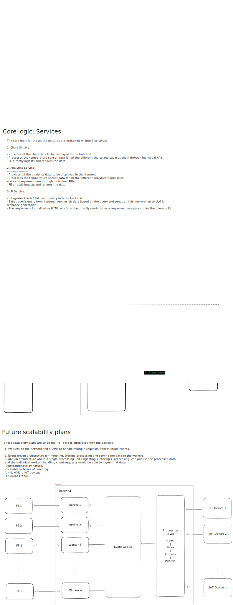

#  EnvAI

**Smart Environmental Monitoring with AI-Powered Insights**

### Demo Video


### Project setup

##### Backend:
- Node.js + Express
- Mock data store (backend/store/db.json)
- Run backend:
```
npm i && npm run dev
```

##### Frontend:
- React.js (using Vite setup)
- Run Frontend:
```
npm i && npm run dev
```

### AI Usage
- Brainstorming of ideas:
   - Come up with an idea for what kind of IoT device to use
- Mock data generation for the IoT temperature collector device
- Automating setup of boilerplate. 

- Use LLM to create a chat assistant for the app which would help users get
  insights on various charts and analytics elements shown in the Dashboard.
- Also allow them to use natural language for asking various queries on the
  devices data.

### Architecture
